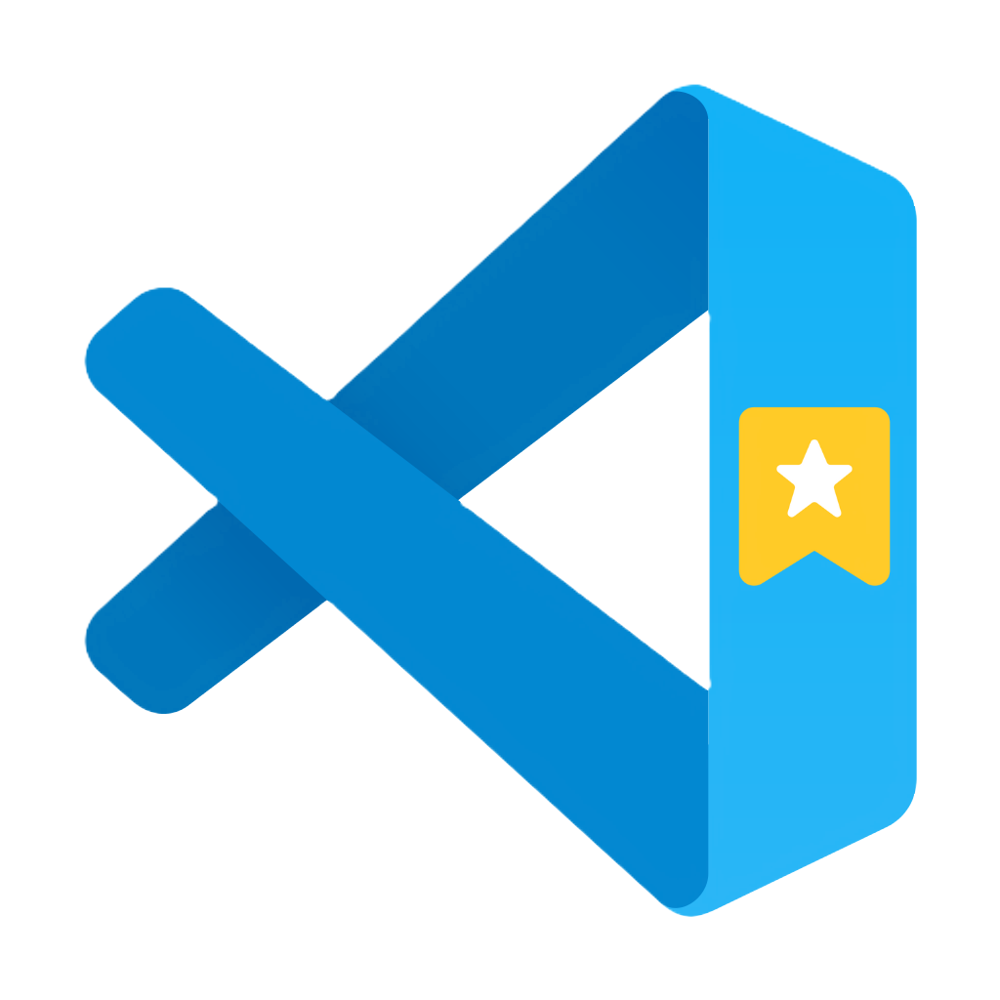

<div align="center">
 <h1>
<br/>
  
<br/>
<br/>
VSCode Bookmark
</h1>
<p >A utility to save your favorite projects and open them easily in vscode.</p>
<a href="https://github.com/ailtonloures/vscode-bookmark/releases">Download</a>
<br />
<br />


</div>

## Features

- Save projects path on Store
- Open projects in VSCode
- Logs and Monitoring with Sentry

## How to use

To clone and run this application, you'll need [Git](https://git-scm.com) and [Node.js](https://nodejs.org/en/download/) (which comes with [npm](http://npmjs.com)) installed on your computer. From your command line:

```bash
# Clone this repository
$ git clone https://github.com/ailtonloures/vscode-bookmark

# Go into the repository
$ cd vscode-bookmark

# Install dependencies
$ npm install

# Run the app
$ npm start
```

### Build

After installing all dependencies, to build the project you need to run the `make` command. From your command line:

```bash
# Go into the repository
$ cd vscode-bookmark

# Run the make command
$ npm run make
```

## Credits

This software uses the following open source packages:

- [Electron](https://www.electronjs.org/)
- [Electron Forge](https://www.electronforge.io/)
- [Electron Store](https://github.com/sindresorhus/electron-store#readme)
- [Node.js](https://nodejs.org/)
- [ESlint](https://eslint.org/)
- [Prettier](https://prettier.io/)
- [Sentry](https://sentry.io/)

## License

[MIT](LICENSE.md)
